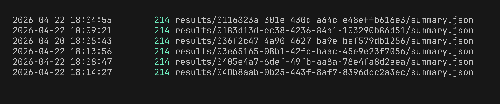
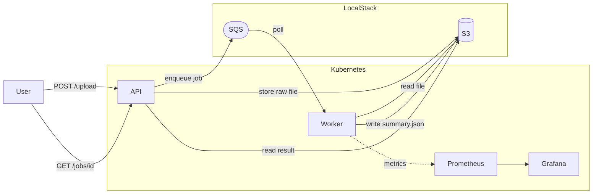

# K8s-log-processor

Log processing pipeline built on Kubernetes. Upload a log file or image via the API — a worker picks it up from SQS, parses HTTP metrics (or runs OCR on images), and writes results to S3. Deployed via ArgoCD GitOps, monitored with Prometheus + Grafana.

## Screenshots

### ArgoCD — apps synced and healthy


### Grafana — worker metrics dashboard


### Pods running


### S3 bucket contents


## Architecture



## S3 Layout

```
log-processing/
├── uploads/
│   └── {job_id}/
│       └── {filename}          # raw upload (log file or image)
└── results/
    └── {job_id}/
        └── summary.json        # parsed result written by worker
```

`summary.json` example:
```json
{
  "total_requests": 842,
  "error_count": 17,
  "source": "text",
  "job_id": "abc123",
  "status": "done"
}
```

## Features

- **Async job processing** — upload returns a `job_id` immediately; poll for result via SQS + S3
- **OCR support** — send images of logs; worker extracts text with Tesseract and parses them
- **Prometheus metrics** — messages processed/failed, OCR stats, processing duration, HTTP error counts
- **GitOps with ArgoCD** — push to [K8s-log-processor-config](https://github.com/4b93f/K8s-log-processor-config), cluster updates automatically
- **Multi-arch Docker builds** — `linux/amd64` + `linux/arm64`
- **Snyk scanning** — dependency and container image scanning in CI
- **One-command setup** — `make setup && make monitoring && make infra && make deploy`

## Why LocalStack

LocalStack emulates AWS services (S3, SQS) locally — no AWS account or cost needed. The app code uses the standard boto3 SDK and is unaware it's talking to LocalStack instead of real AWS. Swapping to a real AWS environment requires only changing the endpoint URLs and credentials in `values.yaml`.

## CI/CD

GitHub Actions on every push to `main` (when `app/` files change):

1. Build + push multi-arch Docker images to GHCR
2. Snyk dependency scan
3. Snyk container image scan

Kubernetes deployment is handled by ArgoCD via [K8s-log-processor-config](https://github.com/4b93f/K8s-log-processor-config) — push to that repo, cluster updates automatically.

## Repo Structure

```
K8s-log-processor/                 # this repo
├── app/
│   ├── api/                       # FastAPI — upload, poll, health
│   └── worker/                    # SQS consumer, log parser, OCR
├── terraform/
│   ├── modules/aws/               # S3 + SQS modules
│   └── environments/dev/          # LocalStack config
├── .github/workflows/ci.yaml      # build, push, Snyk scan
├── Makefile                       # one-command setup
└── docs/screenshots/

K8s-log-processor-config/                   # separate GitOps repo
├── argocd/                        # ArgoCD Application manifests
├── chart/                         # Helm chart (API + Worker)
└── grafana/                       # dashboard JSON
```

Kubernetes config lives in a separate repo: [K8s-log-processor-config](https://github.com/4b93f/K8s-log-processor-config)

## Worker Metrics

| Metric | Description |
|--------|-------------|
| `worker_messages_processed_total` | Successfully processed messages |
| `worker_messages_failed_total` | Failed messages |
| `worker_lines_processed_total` | Log lines parsed |
| `worker_http_errors_found_total` | 4xx/5xx errors found |
| `worker_ocr_processed_total` | Images processed via OCR |
| `worker_ocr_failed_total` | OCR failures |
| `worker_processing_duration_seconds` | Processing time histogram |

## Local Setup

### Prerequisites

| Tool | Purpose |
|------|---------|
| [Minikube](https://minikube.sigs.k8s.io/) | Local Kubernetes cluster |
| [kubectl](https://kubernetes.io/docs/tasks/tools/) | Kubernetes CLI |
| [Helm](https://helm.sh/docs/intro/install/) | Chart management |
| [LocalStack](https://docs.localstack.cloud/getting-started/installation/) | Local AWS (S3 + SQS) — needs an auth token from [app.localstack.cloud](https://app.localstack.cloud) |
| [Terraform](https://developer.hashicorp.com/terraform/install) | Provision AWS resources |

### Start LocalStack first

```bash
localstack start
```

### Then run in order

```bash
make setup       # start Minikube + install ArgoCD
make monitoring  # deploy Prometheus + Grafana (waits for CRDs)
make infra       # provision S3 + SQS on LocalStack
make deploy      # deploy the app via ArgoCD
```

> `make monitoring` creates `.env` from `.env.example` on first run — set `GRAFANA_PASSWORD`, then re-run.

> `make infra` creates `terraform/environments/dev/terraform.tfvars` on first run — add your LocalStack auth token from [app.localstack.cloud](https://app.localstack.cloud), then re-run.

### Test

```bash
make test        # health check + upload test log + fetch result
```

### Access services

| Service | URL | Credentials |
|---------|-----|-------------|
| API | `http://$(minikube ip):$(kubectl get svc api -n app -o jsonpath='{.spec.ports[0].nodePort}')` | — |
| Grafana | `http://$(minikube ip):30300` | admin / value from `.env` |
| ArgoCD | `kubectl port-forward svc/argocd-server -n argocd 8080:443` | password from `make setup` output |

### Teardown

```bash
make reset       # delete Minikube + stop LocalStack + clear Terraform state
```

## API Reference

| Method | Path | Description |
|--------|------|-------------|
| `GET` | `/health` | Health check |
| `POST` | `/upload` | Upload log file or image |
| `GET` | `/jobs/{job_id}` | Get job result |
